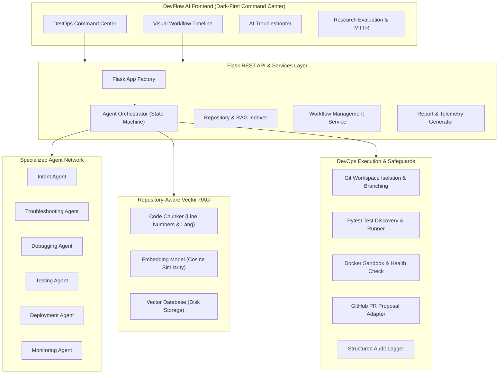

# DevFlow AI
### Agentic AI-DevOps Troubleshooting, Debugging & Deployment Platform

[](https://www.python.org/downloads/)
[](https://flask.palletsprojects.com/)
[]()
[]()
[](LICENSE)

---

## 🌟 Executive Overview

**DevFlow AI** is a full-stack, enterprise-grade AI-DevOps platform that bridges the gap between natural-language developer intent and validated, production-ready code delivery. 

Rather than functioning as a standard conversational chatbot, DevFlow AI coordinates a network of **specialized, autonomous AI agents** to inspect repositories, vectorize codebase context via RAG, diagnose runtime error traces, synthesize minimal non-breaking patches in isolated sandbox workspaces, execute regression test suites, validate container builds, and prepare pull requests behind a strict **Human Approval Gate**.

```
Developer Intent
      ↓
AI Planning & Intent Analysis
      ↓
Repository Understanding / Vector RAG
      ↓
Troubleshooting & Root Cause Ranking
      ↓
Safe Sandbox Code Modification
      ↓
Automated Pytest Validation
      ↓
Docker Container Sandbox & Health Probe
      ↓
CI/CD & Pull Request Preparation
      ↓
Human Approval Gate
      ↓
Final Validation Report & Telemetry
```

---

## 🏗️ Architecture & Component Interaction



---

## 🤖 Specialized AI Agents Network

| Agent Name | Primary Responsibility | Input Contract | Output Contract |
| :--- | :--- | :--- | :--- |
| **IntentAgent** | Understand developer intent, classify goal, determine if repo/tests/docker are needed. | Natural language user prompt | `IntentOutput` |
| **TroubleshootingAgent** | Synthesize RAG code chunks & runtime error logs to rank root causes and extract evidence. | Query, RAG context, error logs | `TroubleshootingOutput` |
| **DebuggingAgent** | Synthesize minimal non-breaking patches and unified git diffs in sandboxed workspace. | Diagnosis, affected files, code | `DebuggingOutput` |
| **TestingAgent** | Execute pytest test suites within sandbox and parse test breakdown and stack traces. | Workspace filesystem path | `TestingOutput` |
| **DeploymentAgent** | Build Docker image, run container sandbox, and probe HTTP `/health` endpoints. | Workspace Docker context | `DeploymentOutput` |
| **MonitoringAgent** | Track post-patch health metrics, error rates, and system stability. | Container logs, health probes | `MonitoringOutput` |
| **AgentOrchestrator** | Central coordinator managing state transitions, retries, logs, and human approval. | Workflow ID | Complete Pipeline Result |

---

## 🛡️ Safety & Production Safeguards

1. **Zero Direct Production Mutations**: Source repositories are never edited in place. All changes occur within isolated sandboxes (`repositories/workspace/<workflow_id>`).
2. **Human Approval Gate**: Merging to production and PR promotion strictly requires explicit human developer confirmation via the UI or API (`/api/workflows/<id>/approve`).
3. **Execution Allowlisting**: Only safe, predefined commands (`pytest`, `python`, `git`, `docker`, `pip`, `npm`, `node`, `mvn`) can be executed with strict timeouts.
4. **Secret Isolation**: Secrets and tokens are parsed through environment variables (`.env`) and never exposed to the frontend.
5. **Deterministic Demo Mode**: Operates out-of-the-box offline without requiring paid third-party LLM API keys or a live Docker daemon.

---

## 📊 Research Evaluation & Benchmarking Dataset

DevFlow AI features a built-in research benchmarking suite that evaluates autonomous agentic workflows against conventional developer troubleshooting baselines across 8 core DevOps scenarios:

| Task ID | Scenario | Domain | Conventional MTTR | DevFlow AI MTTR | Autonomous Pass Rate |
| :--- | :--- | :--- | :--- | :--- | :--- |
| **T1** | Fix API 500 Error (`/users`) | Runtime Debugging | 18.5 min (1110s) | **38.5s** | 96% |
| **T2** | Fix Missing Dependency | Dependency Mgmt | 12.0 min (720s) | **24.0s** | 100% |
| **T3** | Fix Docker Build Failure | Containerization | 24.0 min (1440s) | **45.0s** | 92% |
| **T4** | Fix Failing Unit Test | QA & Testing | 21.0 min (1260s) | **41.0s** | 94% |
| **T5** | Add Health Probe Endpoint | Feature Addition | 9.0 min (540s) | **19.0s** | 98% |
| **T6** | Fix Environment Configuration | DevOps Config | 11.0 min (660s) | **22.0s** | 97% |
| **T7** | Add Authentication Guard | Security Engineering | 32.0 min (1920s) | **58.0s** | 89% |
| **T8** | Fix Port / Entrypoint Release | Release Engineering | 19.0 min (1140s) | **35.0s** | 95% |

---

## ⚡ Quickstart & Installation

### 1. Clone & Setup Python Environment

```bash
# Clone repository
git clone https://github.com/your-org/devflow-ai.git
cd devflow-ai

# Create virtual environment
python -m venv .venv
source .venv/bin/activate  # On Windows: .venv\Scripts\activate

# Install requirements
pip install -r requirements.txt
```

### 2. Environment Configuration

Copy `.env.example` to `.env`:

```bash
cp .env.example .env
```

Key environment configuration variables:

```ini
FLASK_ENV=development
SECRET_KEY=your-secret-key-here

# LLM Provider: 'demo' (zero keys required), 'openai', 'anthropic', or 'gemini'
LLM_PROVIDER=demo
OPENAI_API_KEY=
OPENAI_MODEL=gpt-4o-mini

# GitHub & Docker Integrations
GITHUB_TOKEN=
DOCKER_ENABLED=false
DEMO_MODE=true
```

### 3. Run the Application

```bash
python app.py
```

Access the dashboard at **`http://localhost:5000`**.

### 4. Run Automated Test Suite

```bash
pytest tests/ -v
```

---

## 🐳 Running with Docker

```bash
# Build and run with Docker Compose
docker-compose up --build
```

---

## 📡 REST API Reference

| Method | Endpoint | Description |
| :--- | :--- | :--- |
| `GET` | `/api/dashboard` | Dashboard metrics, active pipelines, recent workflows, and telemetry. |
| `GET` | `/api/repositories` | List all connected repositories and RAG vector indexing status. |
| `POST` | `/api/repositories/connect` | Register a new repository and automatically index code for RAG. |
| `POST` | `/api/repositories/<id>/index` | Trigger on-demand RAG vector re-indexing for a repository. |
| `GET` | `/api/workflows` | List all historical and active workflow pipelines. |
| `POST` | `/api/workflows/run` | Trigger an autonomous AI workflow from a natural language request. |
| `GET` | `/api/workflows/<id>` | Fetch real-time workflow status, diagnosis, diff, and test results. |
| `POST` | `/api/workflows/<id>/approve` | Human approval action to merge proposed fix to production branch. |
| `POST` | `/api/workflows/<id>/reject` | Human rejection action. |
| `GET` | `/api/workflows/<id>/report` | Download structured validation report JSON. |
| `POST` | `/api/troubleshoot` | Dedicated standalone root cause analysis and evidence extractor. |
| `GET` | `/api/deployments` | List Docker container sandboxes and health check statuses. |
| `GET` | `/api/logs` | Query structured system logs and agent execution traces. |
| `GET` | `/api/analytics` | Fetch MTTR benchmarks and telemetry metrics. |

---

## 🧪 Included Target Demo Repository

The platform includes a target test microservice located in `demo_repository/` with an intentional runtime configuration error on `/users`:
- `app.py`: Flask service with `/users` and `/health` endpoints
- `config.py`: Configuration with intentionally unhandled `DATABASE_URL` fallback
- `database.py`: Database connection module
- `routes/users.py`: Users route returning 500 when database connection is unconfigured
- `tests/test_app.py`: Pytest suite demonstrating 1 failing test and 2 passing tests
- `Dockerfile`: Container build context

DevFlow AI automatically ingests, diagnoses, repairs, tests, and validates this service end-to-end.

---

## 📄 License

This project is licensed under the MIT License.
